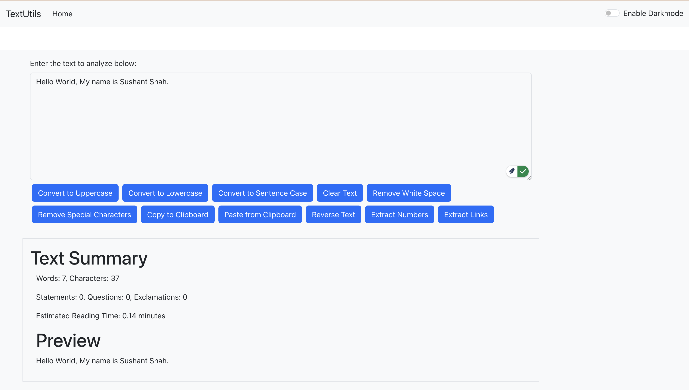
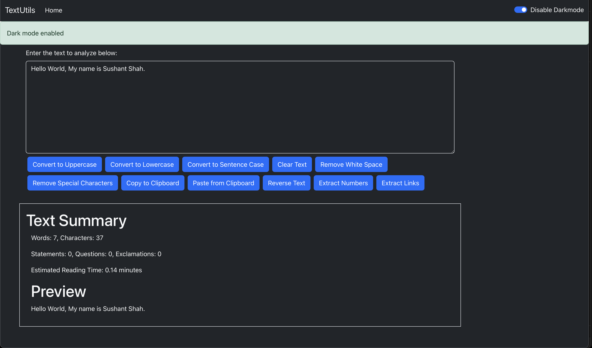

# Text Utils

Text Utils is a simple, powerful React-based text utility application designed to analyze and manipulate text efficiently. Whether you need to convert text to uppercase, lowercase, remove special characters, or calculate text statistics like word count, Text Utils has you covered!

## Features

- **Text Transformations**:
  - Convert to Uppercase
  - Convert to Lowercase
  - Clear Text
  - Reverse Text
  - Convert to Sentence Case

- **Text Analysis**:
  - Word Count
  - Character Count
  - Number of Statements, Questions, and Exclamations
  - Reading Time Estimation
  - Words Per Minute (WPM)

- **Text Utilities**:
  - Extract Numbers
  - Extract Links
  - Remove Extra Spaces
  - Remove Special Characters
  - Copy to Clipboard
  - Paste from Clipboard

- **Dark Mode Support**:
  - Toggle between Light and Dark modes for better accessibility.

## Output

### Light Mode

### Dark Mode

